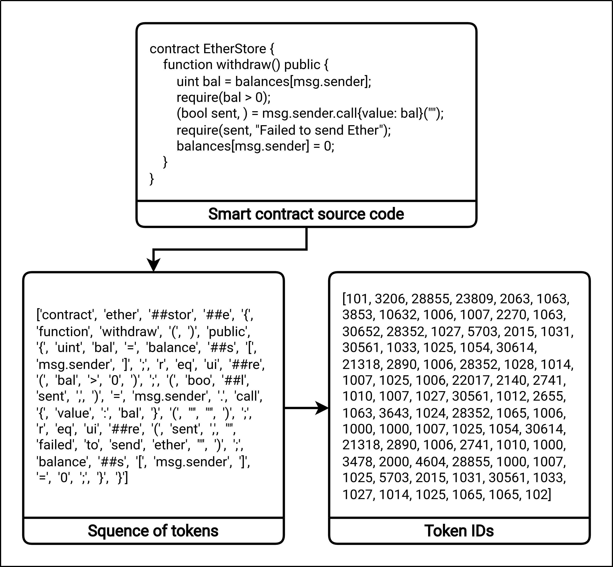
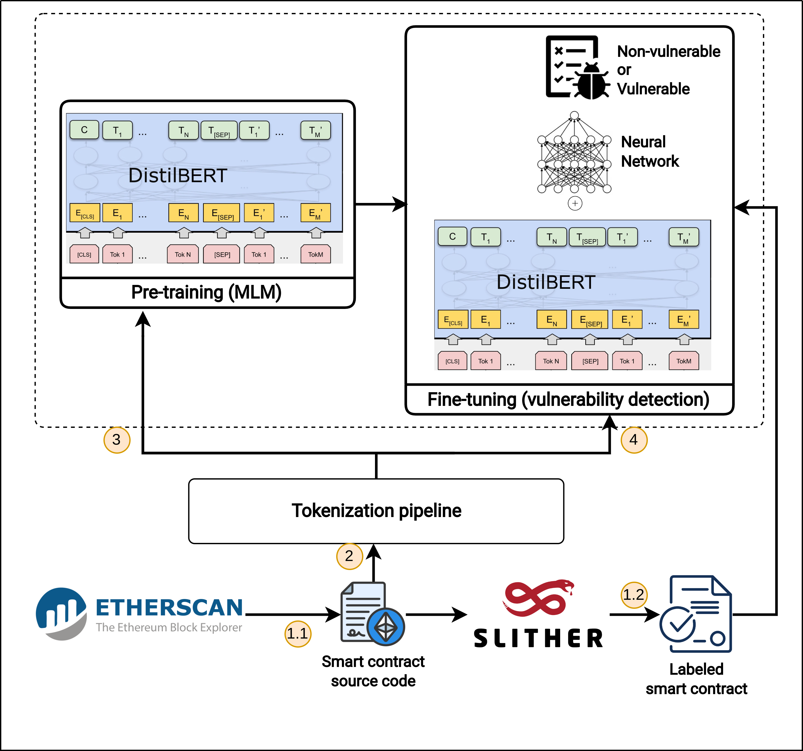
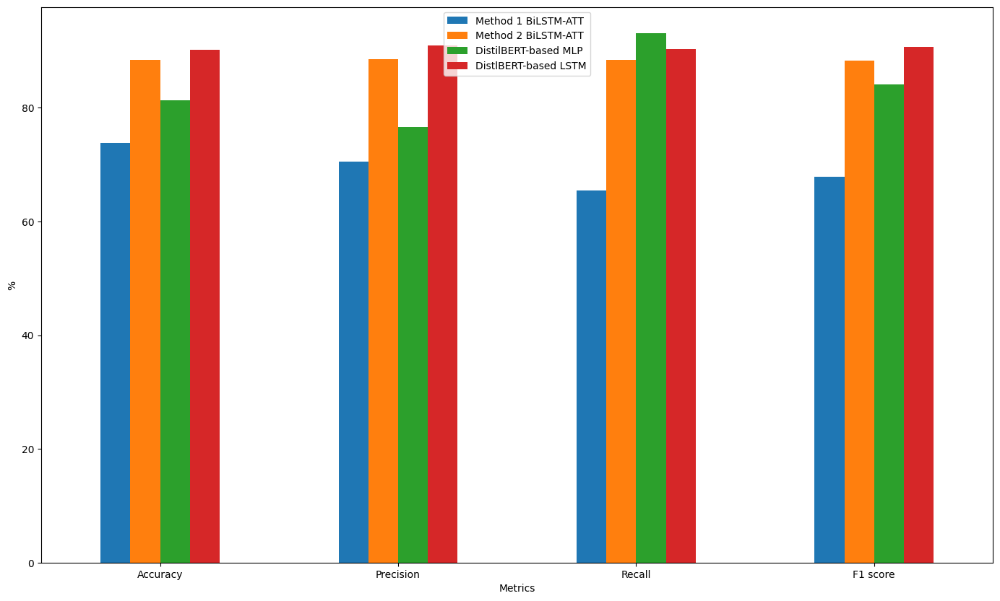

# Research

## Knowledge
* Data processing
* Machine Learning
* Fuzzing
* Vulnerability
* Vulnerability Detection Techniques

## Contextual Language Model and Transfer Learning for Reentrancy Vulnerability Detection in Smart Contracts [le2023contextual]

```
@inproceedings{le2023contextual,
  title={Contextual Language Model and Transfer Learning for Reentrancy Vulnerability Detection in Smart Contracts},
  author={Bằng Lê Hồng, Thắng Lê Đức, Trung Đoàn Minh, Dũng Trần Tuấn, Duy Phan Thế, Hậu Phạm Văn},
  booktitle={Proceedings of the 12th International Symposium on Information and Communication Technology},
  pages={739--745},
  year={2023}
}
```






## References 

[le2023contextual]: https://dl.acm.org/doi/abs/10.1145/3628797.3628945
